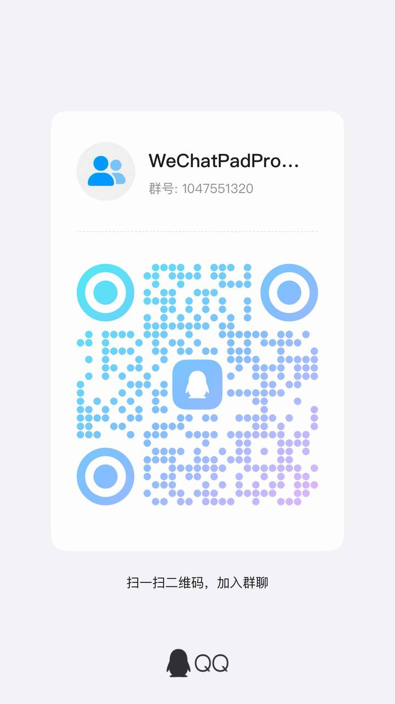
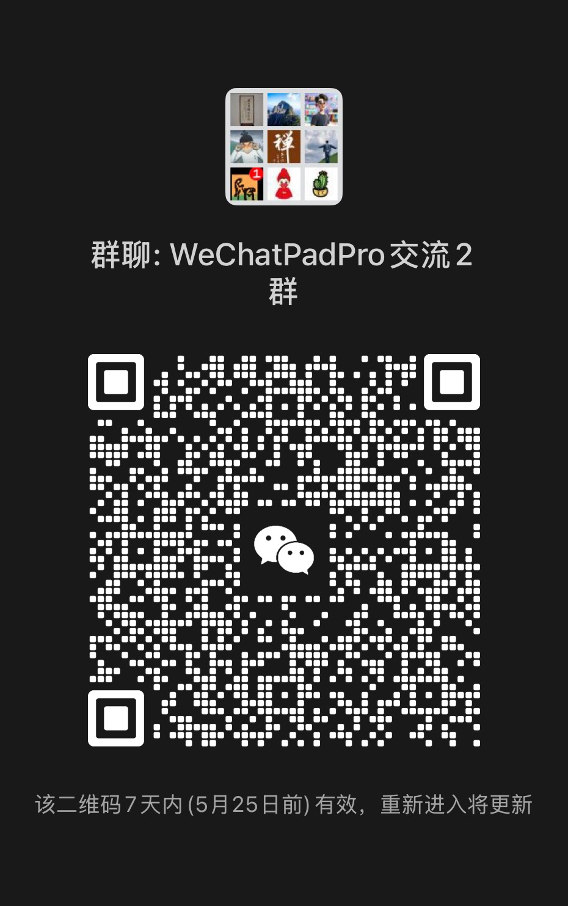

# WeChatPadPro

<div align="center">
    <h3>🚀 基于 WeChat Pad 协议的高级微信管理工具 🚀</h3>
    <p align="center">
        
        
        <a href="https://t.me/+LK0JuqLxjmk0ZjRh">
            
        </a>
        <a href="https://pd.qq.com/s/9hk7qzj9p">
        </a>
    </p>
    <p align="center">
        <b>⭐️ 欢迎加入官方交流群 ⭐️</b><br>
        <span style="font-size: 1.2em;">
            👉 <a href="https://t.me/+LK0JuqLxjmk0ZjRh">Telegram 群组</a> | 
        </span><br>
        获取最新版本更新、技术支持和使用教程
    </p>
</div>

<div align="center">

[📢 加入交流群](#-加入官方交流群) •
[🎉 最新更新](#-最新更新-v8059) •
[📝 功能特性](#-功能特性) •
[⚠️ 使用须知](#-重要提醒) •
[📦 安装教程](#-安装指南)

</div>

---

## 📢 加入官方交流群

<table>
<tr>
<td width="33%">

### 💬 Telegram 交流群
- 🔗 群组链接：[点击加入](https://t.me/+LK0JuqLxjmk0ZjRh)
- 👥 当前成员：203+ 位用户
- 💡 交流内容：
  - 最新版本发布通知
  - 技术问题解答
  - 使用经验分享
  - Bug 反馈与建议

</td>
<td width="33%">

### 🆔 QQ 交流群
- 🔗 群号码：1047551320
- 📱 加入方式：
  - 方式一：扫描右侧二维码
  - 方式二：QQ搜索群号加入

<div align="center">

</div>

</td>
<td width="33%">

### 👥 微信交流群
- 📱 加入方式：扫描下方二维码
- 💡 交流内容：
  - 技术讨论
  - 问题解答
  - 使用经验分享

<div align="center">

</div>

</td>
</tr>
</table>

## 💰 赞助支持

如果您觉得这个项目对您有帮助，欢迎赞助支持我们继续开发维护！

<table>
<tr>
<td width="50%">

### 微信赞赏码
<div align="center">

</div>

</td>
<td width="50%">

### 赞助说明
- 💝 赞助金额不限，感谢每一份支持
- 🎁 赞助者可获得：
  - 优先技术支持
  - 新功能优先体验
  - 定制化需求支持
- 📧 赞助后请联系我们获取权益

</td>
</tr>
</table>

## 💰 知识星球付费用户专属福利

欢迎加入我们的 **知识星球技术社区**，这里不仅是获取第一手项目动态的窗口，更是开发者深入交流、共同成长的高质量平台。

---

### 🎁 加入后您将获得：

- 🔒 **独家内容优先获取**  
  实时掌握项目更新、内部工具、使用技巧与进阶教程。
  
- 🧑‍💻 **专属技术支持**  
  与开发者直接沟通，快速定位并解决使用过程中的问题。
  
- 🌐 **深度社区互动**  
  与志同道合的用户交流经验，共享资源与合作机会。
  
- 📚 **丰富学习资料**  
  提供微信自动化、群控场景、实战案例等系统性知识内容。

---

### 🆕 新社区 · 早鸟福利限时开放！

本社区为**全新上线**，我们正在逐步构建一个高质量、高互动的交流平台。

> 🎯 当前加入的成员将成为**首批种子用户**，享受：
>
> - 优先提问与答疑
> - 社区发展建议采纳权
> - 后续增值权益锁定价保障

---

### 💳 加入费用

- 📅 **年度会员价：￥199 元/年**  
  一次性付费，全年畅享全部专属内容与服务。

---

### 📲 立即加入

- 🔗 点击链接：[立即加入知识星球](https://t.zsxq.com/Ygl6l)
- 📷 扫描下方二维码加入：

<p align="center">
  
</p>

---

### 🚀 加入我们，共建高质量技术社区！

如果你关注微信管理与自动化，正在寻找一个高效、实用、有干货的学习交流圈，欢迎加入我们，一起从 0 打造一个真正有价值的社区！

> 📌 趁现在加入，锁定核心成员身份，参与共建，抢占成长红利！


WeChatPadPro 是基于 WeChat Pad 协议的高级微信管理工具，支持以下功能：
### 🔧 MCP增强功能
- ⚡ 多协议适配：自动识别并适配不同版本的微信协议
- ⚡ 自动化管理：通过MCP配置实现好友请求自动通过、消息同步

### 🌐 MCP模型上下文协议
├─ 协议标准：提供LLM与外部系统的标准化交互接口
├─ 多模态支持：文本/图像/音频的上下文统一处理
├─ 动态加载：运行时配置热更新机制
└─ 开源生态：兼容HuggingFace/OpenAI等主流模型平台


- 朋友圈收发与互动（点赞、评论）
- 好友管理（添加、删除、清理僵尸粉）
- 消息收发（文本、图片、名片、动图、文件）
- 微信支付（转账、红包）
- 小程序和名片分享
- 通讯录好友添加
- 微信收藏
- 标签管理

此外，还支持强大的群管理功能，包括：

- 消息群发
- 自动通过好友请求
- 建群、拉人进群、踢群成员、邀请成员、退群
- 修改群名称、群公告发布
- 多群消息同步等

WeChatPadPro 适用于个人微信增强、运营管理和自动化交互，提升微信使用效率和管理能力。

## 联系我们

如有任何问题或建议，欢迎通过 GitHub Issues 或邮件与我们联系。

---

感谢您的支持和鼓励！


---


# 忠告: 切记莫贪,新号尽量稳定挂机 3 天后再使用(危险性高的API操作),过来人的忠告

> 注意看下面的[关于风控](##关于风控)问题；


# 异地登录一定要设置同市Socks5代理


> 注意看下面的[关于风控](##关于风控)问题；
>
> 代理链接格式：`socks5://用户名:密码@代理IP:代理端口`
>
> 尽量找同市IP，没有可以用同省IP；
>
> 新号首次登录时(同省IP首次可能会多次掉线, 同市掉线少, 家里的内网穿透 socks5 代理IP基本不会掉线)；
>
> 不会搭建家里的内网穿透 socks5 代理的可联系我搭建；
>
> frp：https://github.com/fatedier/frp/releases；


# 新号首次登录时,可能立即掉线,多扫码登录两次即可稳定;另本服务内部自动保持登录心跳


> 注意看下面的[关于风控](##关于风控)问题；
>
> 新号登录后，24小时内可能还会掉线一次(如下图)，再次登录即可(登录时使用原来的Api `key`，不要切换新的，更换`key`相当于新设备登录了)；再次登录后基本3个月内不会掉线；
>
> 注意⚠️：一个授权码`key`只能给一个微信号使用，多个号请生成多个授权码`key`；
>
> 3天后基本稳定，7天后更稳了；


---


# 食用方法


## 环境依赖

- 本程序只需要安装MySQL、Redis即可；不会安装的见后续安装方法：[Windows安装](#Windows安装)、[Linux安装](#Linux安装)；
- windows-redis：https://github.com/tporadowski/redis/releases；

- MySQL(最好是5.7之后, 如果是5.6、5.7的话先使用[wechat_mmtls.sql](./wechat_mmtls.sql)提前创建好数据库表也能用)
  - 创建数据库`wechat_mmtls`、用户名`wechat_mmtls`，密码`12345678`
- Redis
  - 设置密码`12345678`


- MySQL5.7之前版本数据库会报错如下：


- MySQL5.7可以修改配置(允许扩展索引长度)后，重启mysqld服务：

```ini
[mysqld]
innodb_file_format = Barracuda
innodb_file_per_table = 1
innodb_large_prefix = 1

```


### MySQL绿色版安装

> 绿色版MySQL适用于所有OS系统；https://downloads.mysql.com/archives/community/；
>
> `MySQL5.7`包括之后版本：[Windows安装绿色版Mysql数据库](https://blog.csdn.net/FL1623863129/article/details/138196075)；
>
> ```shell
> # MySQL初始化---随机生成root密码
> mysqld --initialize --console
> 
> # MySQL初始化---不设置root密码
> mysqld --initialize-insecure
> 
> ```
>
> 
>
> `MySQL5.6`包括之前版本绿色安装时：需要使用`mysql_install_db`；
>
> 如果你的`bin`目录里有`mysql_install_db`二进制包，直接执行即可：
>
> ```shell
> # 01 使用mysql_install_db初始化数据目录
> mysql_install_db --datadir="/path/to/your/mysql/data"
> # 02 启动MySQL服务
> mysqld --console
> # 03 使用mysqladmin设置root密码
> mysqladmin -u root password "你要设置的root密码"
> 
> # 04 验证登录
> mysql -u root -p
> ```
>
> `bin`目录里没有`mysql_install_db`二进制包，需要使用`Perl`语言的运行时环境执行`scripts/mysql_install_db.pl`脚本来初始化MySQL数据目录；
>
> - Linux/Mac一般都内置了Perl，`perl -v`查看版本；
> - Windows：在这里[Strawberry Perl](https://strawberryperl.com/)下载安装，[5.40.0.1-64bit.msi](https://github.com/StrawberryPerl/Perl-Dist-Strawberry/releases/download/SP_54001_64bit_UCRT/strawberry-perl-5.40.0.1-64bit.msi)；
>
> ```shell
> cd /path/to/mysql/scripts
> perl mysql_install_db.pl --datadir="/path/to/your/mysql/data"
> ```
>
> 


### Windows安装


- 需要啥版本的msi自己找：https://downloads.mysql.com/archives/installer/；

- MySQL傻瓜式msi安装：点击直接下载安装，[mysql-x86-5.6.51.0.msi](https://downloads.mysql.com/archives/get/p/25/file/mysql-installer-community-5.6.51.0.msi)，[mysql-x86-5.5.60.1.msi](https://downloads.mysql.com/archives/get/p/25/file/mysql-installer-community-5.5.60.1.msi)，[mysql-x86-5.7.44.0.msi](https://dev.mysql.com/get/Downloads/MySQLInstaller/mysql-installer-community-5.7.44.0.msi)，[mysql-x86-8.0.39.0.msi](https://dev.mysql.com/get/Downloads/MySQLInstaller/mysql-installer-community-8.0.39.0.msi)；
- 可以看见这些msi都是x86的，32位CPU寻址空间，最大支持4GB的RAM内存；
- 如果想本地安装64位，可以使用绿色版方法下载手动安装；


- 注意：安装时一定要选择`自定义安装`，然后仅仅安装 `MySQL-Server`即可，注意设置root用户的密码一定要记住；


### Linux安装

> [!NOTE]
>
> Linux直接使用[宝塔](https://www.bt.cn/new/product_linux.html)安装即可；注意按照提示安装MySQL的版本即可，配置低的云服务器请使用低版本MySQL；2H2G服务器
>
> 如果是mysql5.7以下，创建完：数据库`wechat_mmtls`、用户名`wechat_mmtls`，密码`12345678`后；
>
> 先使用部署包里的[wechat_mmtls.sql](./wechat_mmtls.sql)提前创建好数据库表；


## 软件配置

> `assets/setting.json`：全局配置
>
> `assets/owner.json`：管理员/所有者 配置


### setting.json

> 你能修改的字段如下，其他字段**不用修改！不用修改！**；
>
> - debug：是否开启debug日志；
> - port：当前服务端口号；
> - apiVersion：当前服务API版本，例如这里的`/v849`就是API版本，`http://127.0.0.1:8848/v849`；可以设为空简化URL，此时服务BASE_URL为`http://127.0.0.1:8848`；
> - ghWxid：要引流关注的微信公众号的wxid；新用户登录时自动关注；默认为空，不关注任何公众号；
> - adminKey：管理相关接口(例如`GenAuthKey`等接口)的授权KEY，若留空每次服务启动随机生成；
> - redisConfig.Port：Redis服务端口号；
> - redisConfig.Db：要使用的Redis几号数据库；
> - redisConfig.Pass：Redis服务密码；
> - mySqlConnectStr：`用户名:密码@tcp(127.0.0.1:3306)/数据库名?charset=utf8mb4&parseTime=true&loc=Local`；

```json
{
  "debug": false,
  "host": "0.0.0.0",
  "port":"8848",
  "apiVersion": "/v849",
  "ghWxid": "",
  "adminKey": "",
  "redisConfig": {
    "Host":            "127.0.0.1",
    "Port":            6379,
    "Db":              1,
    "Pass":           "12345678"
  },
  "mySqlConnectStr": "wechat_mmtls:12345678@tcp(127.0.0.1:3306)/wechat_mmtls?charset=utf8mb4&parseTime=true&loc=Local"
}

```


### owner.json

> 这里要设置管理员微信号的`wxid`，注意是`wxid`，不要设置错了；
>
> 这里设置管理员`wxid`后，管理员扫码登录后，可以使用微信的`文件传输助手使用部分命令管理；

```json
{
  "wxid_xxx": 1
}
```


## 启动教程

1. 修改基础设置 [setting.json](./assets/setting.json) 

   设置你自己的`adminKey`或留空随机，修改mysql 与 redis的连接地址、账户名、密码等信息；

2. 修改管理员设置 [owner.json](./assets/owner.json) 

   添加你的 `wxid`，注意是`wxid`，别填错了；

3. `MySQL57`包括以下版本可以使用此命令初始化：

   - linux：`./01_InitMySQL -passwd="你的root密码"`；
   - win cmd执行：`01_InitMySQL.exe -passwd="你的root密码"`；

4. 启动Web服务：

   - Linux启动命令：`/opt/wechat/wechat_service >/opt/wechat/run.log 2>&1 &`；
   - win直接双击`wechat_service.exe`启动

   

5. 获取全程操作的AuthKey：http://127.0.0.1:8848/v849/login/GenAuthKey2?key=ADMIN_KEY&count=1&days=365 (生成 `count=`1 个有效期为 `days=`365 的API授权码)；

   注意：服务Owner(超级管理员)也可以在微信的`文件管理助手`生成key；

6. 登录：

   - 1、获取二维码，传家附近的代理：`socks5://用户名:密码@代理IP:代理端口`
   - 2、获取二维码状态


## 关于风控
以下图片来自网络,并非本项目,仅供参考


## 关于测试

> 可下载 [ApiPOST(v7.2.X)经典版！经典版！](https://www.apipost.cn/download.html) 后，将 [微信849.apipost.v7.json](./static/swagger/微信849.apipost.v7.json) 直接导入 ApiPOST 使用，导入后先设置 环境为：【小小彩笔的环境】；`ApiPOST-v8版`目前无法使用 ws 长链接 发送/接收 同步消息请求；
>
> 
>
> 之后，必须要设置以下环境变量：
>
> - `WS_URL`：你的WX-Web-API服务的WebSocket基础URL，例如 `ws://127.0.0.1:8848/v849`；
> - `ADMIN_KEY`：请求`/login/GenAuthKey`、`/login/GenAuthKey2`接口所需的管理接口KEY；
> - `SOCKS5`：socks5代理；最好是家附近的代理IP，其次同市IP，最其次同省IP；异地IP极易风控；
>
> 
>
> 之后，请求`/login/GenAuthKey`或`/login/GenAuthKey2`接口，将生成的UUID保存为`TOKEN_KEN`环境变量即可，之后所有WX接口操作均会携带该值；
>
> 
>
> 另外注意：这些ApiPOST接口定义里面，部分已经内置好了【请求的后置处理操作】---【自定义处理resopnse响应的脚本】，会自动提取并设置某些环境变量的值；
>
> 


## 关于测试

> 可下载 [ApiPOST(v7.2.X)经典版！经典版！](https://www.apipost.cn/download.html) 后，将 [微信849.apipost.v7.json](./static/swagger/微信849.apipost.v7.json) 直接导入 ApiPOST 使用，导入后先设置 环境为：【小小彩笔的环境】；`ApiPOST-v8版`目前无法使用 ws 长链接 发送/接收 同步消息请求；
>
> 
>
> 之后，必须要设置以下环境变量：
>
> - `WS_URL`：你的WX-Web-API服务的WebSocket基础URL，例如 `ws://127.0.0.1:8848/v849`；
> - `ADMIN_KEY`：请求`/login/GenAuthKey`、`/login/GenAuthKey2`接口所需的管理接口KEY；
> - `SOCKS5`：socks5代理；最好是家附近的代理IP，其次同市IP，最其次同省IP；异地IP极易风控；
>
> 
>
> 之后，请求`/login/GenAuthKey`或`/login/GenAuthKey2`接口，将生成的UUID保存为`TOKEN_KEN`环境变量即可，之后所有WX接口操作均会携带该值；
>
> 
>
> 另外注意：这些ApiPOST接口定义里面，部分已经内置好了【请求的后置处理操作】---【自定义处理resopnse响应的脚本】，会自动提取并设置某些环境变量的值；
>
> 


## 关于测试

> 可下载 [ApiPOST(v7.2.X)经典版！经典版！](https://www.apipost.cn/download.html) 后，将 [微信849.apipost.v7.json](./static/swagger/微信849.apipost.v7.json) 直接导入 ApiPOST 使用，导入后先设置 环境为：【小小彩笔的环境】；`ApiPOST-v8版`目前无法使用 ws 长链接 发送/接收 同步消息请求；
>
> 
>
> 之后，必须要设置以下环境变量：
>
> - `WS_URL`：你的WX-Web-API服务的WebSocket基础URL，例如 `ws://127.0.0.1:8848/v849`；
> - `ADMIN_KEY`：请求`/login/GenAuthKey`、`/login/GenAuthKey2`接口所需的管理接口KEY；
> - `SOCKS5`：socks5代理；最好是家附近的代理IP，其次同市IP，最其次同省IP；异地IP极易风控；
>
> 
>
> 之后，请求`/login/GenAuthKey`或`/login/GenAuthKey2`接口，将生成的UUID保存为`TOKEN_KEN`环境变量即可，之后所有WX接口操作均会携带该值；
>
> 
>
> 另外注意：这些ApiPOST接口定义里面，部分已经内置好了【请求的后置处理操作】---【自定义处理resopnse响应的脚本】，会自动提取并设置某些环境变量的值；
>
> 


## 关于测试

> 可下载 [ApiPOST(v7.2.X)经典版！经典版！](https://www.apipost.cn/download.html) 后，将 [微信849.apipost.v7.json](./static/swagger/微信849.apipost.v7.json) 直接导入 ApiPOST 使用，导入后先设置 环境为：【小小彩笔的环境】；`ApiPOST-v8版`目前无法使用 ws 长链接 发送/接收 同步消息请求；
>
> 
>
> 之后，必须要设置以下环境变量：
>
> - `WS_URL`：你的WX-Web-API服务的WebSocket基础URL，例如 `ws://127.0.0.1:8848/v849`；
> - `ADMIN_KEY`：请求`/login/GenAuthKey`、`/login/GenAuthKey2`接口所需的管理接口KEY；
> - `SOCKS5`：socks5代理；最好是家附近的代理IP，其次同市IP，最其次同省IP；异地IP极易风控；
>
> 
>
> 之后，请求`/login/GenAuthKey`或`/login/GenAuthKey2`接口，将生成的UUID保存为`TOKEN_KEN`环境变量即可，之后所有WX接口操作均会携带该值；
>
> 
>
> 另外注意：这些ApiPOST接口定义里面，部分已经内置好了【请求的后置处理操作】---【自定义处理resopnse响应的脚本】，会自动提取并设置某些环境变量的值；
>
> 


## 关于测试

> 可下载 [ApiPOST(v7.2.X)经典版！经典版！](https://www.apipost.cn/download.html) 后，将 [微信849.apipost.v7.json](./static/swagger/微信849.apipost.v7.json) 直接导入 ApiPOST 使用，导入后先设置 环境为：【小小彩笔的环境】；`ApiPOST-v8版`目前无法使用 ws 长链接 发送/接收 同步消息请求；
>
> 
>
> 之后，必须要设置以下环境变量：
>
> - `WS_URL`：你的WX-Web-API服务的WebSocket基础URL，例如 `ws://127.0.0.1:8848/v849`；
> - `ADMIN_KEY`：请求`/login/GenAuthKey`、`/login/GenAuthKey2`接口所需的管理接口KEY；
> - `SOCKS5`：socks5代理；最好是家附近的代理IP，其次同市IP，最其次同省IP；异地IP极易风控；
>
> 
>
> 之后，请求`/login/GenAuthKey`或`/login/GenAuthKey2`接口，将生成的UUID保存为`TOKEN_KEN`环境变量即可，之后所有WX接口操作均会携带该值；
>
> 
>
> 另外注意：这些ApiPOST接口定义里面，部分已经内置好了【请求的后置处理操作】---【自定义处理resopnse响应的脚本】，会自动提取并设置某些环境变量的值；
>
> 


## 关于测试

> 可下载 [ApiPOST(v7.2.X)经典版！经典版！](https://www.apipost.cn/download.html) 后，将 [微信849.apipost.v7.json](./static/swagger/微信849.apipost.v7.json) 直接导入 ApiPOST 使用，导入后先设置 环境为：【小小彩笔的环境】；`ApiPOST-v8版`目前无法使用 ws 长链接 发送/接收 同步消息请求；
>
> 
>
> 之后，必须要设置以下环境变量：
>
> - `WS_URL`：你的WX-Web-API服务的WebSocket基础URL，例如 `ws://127.0.0.1:8848/v849`；
> - `ADMIN_KEY`：请求`/login/GenAuthKey`、`/login/GenAuthKey2`接口所需的管理接口KEY；
> - `SOCKS5`：socks5代理；最好是家附近的代理IP，其次同市IP，最其次同省IP；异地IP极易风控；
>
> 
>
> 之后，请求`/login/GenAuthKey`或`/login/GenAuthKey2`接口，将生成的UUID保存为`TOKEN_KEN`环境变量即可，之后所有WX接口操作均会携带该值；
>
> 
>
> 另外注意：这些ApiPOST接口定义里面，部分已经内置好了【请求的后置处理操作】---【自定义处理resopnse响应的脚本】，会自动提取并设置某些环境变量的值；
>
> 


## 关于测试

> 可下载 [ApiPOST(v7.2.X)经典版！经典版！](https://www.apipost.cn/download.html) 后，将 [微信849.apipost.v7.json](./static/swagger/微信849.apipost.v7.json) 直接导入 ApiPOST 使用，导入后先设置 环境为：【小小彩笔的环境】；`ApiPOST-v8版`目前无法使用 ws 长链接 发送/接收 同步消息请求；
>
> 
>
> 之后，必须要设置以下环境变量：
>
> - `WS_URL`：你的WX-Web-API服务的WebSocket基础URL，例如 `ws://127.0.0.1:8848/v849`；
> - `ADMIN_KEY`：请求`/login/GenAuthKey`、`/login/GenAuthKey2`接口所需的管理接口KEY；
> - `SOCKS5`：socks5代理；最好是家附近的代理IP，其次同市IP，最其次同省IP；异地IP极易风控；
>
> 
>
> 之后，请求`/login/GenAuthKey`或`/login/GenAuthKey2`接口，将生成的UUID保存为`TOKEN_KEN`环境变量即可，之后所有WX接口操作均会携带该值；
>
> 
>
> 另外注意：这些ApiPOST接口定义里面，部分已经内置好了【请求的后置处理操作】---【自定义处理resopnse响应的脚本】，会自动提取并设置某些环境变量的值；
>
> 


## 关于测试

> 可下载 [ApiPOST(v7.2.X)经典版！经典版！](https://www.apipost.cn/download.html) 后，将 [微信849.apipost.v7.json](./static/swagger/微信849.apipost.v7.json) 直接导入 ApiPOST 使用，导入后先设置 环境为：【小小彩笔的环境】；`ApiPOST-v8版`目前无法使用 ws 长链接 发送/接收 同步消息请求；
>
> 
>
> 之后，必须要设置以下环境变量：
>
> - `WS_URL`：你的WX-Web-API服务的WebSocket基础URL，例如 `ws://127.0.0.1:8848/v849`；
> - `ADMIN_KEY`：请求`/login/GenAuthKey`、`/login/GenAuthKey2`接口所需的管理接口KEY；
> - `SOCKS5`：socks5代理；最好是家附近的代理IP，其次同市IP，最其次同省IP；异地IP极易风控；
>
> 
>
> 之后，请求`/login/GenAuthKey`或`/login/GenAuthKey2`接口，将生成的UUID保存为`TOKEN_KEN`环境变量即可，之后所有WX接口操作均会携带该值；
>
> 
>
> 另外注意：这些ApiPOST接口定义里面，部分已经内置好了【请求的后置处理操作】---【自定义处理resopnse响应的脚本】，会自动提取并设置某些环境变量的值；
>
> 


## 关于测试

> 可下载 [ApiPOST(v7.2.X)经典版！经典版！](https://www.apipost.cn/download.html) 后，将 [微信849.apipost.v7.json](./static/swagger/微信849.apipost.v7.json) 直接导入 ApiPOST 使用，导入后先设置 环境为：【小小彩笔的环境】；`ApiPOST-v8版`目前无法使用 ws 长链接 发送/接收 同步消息请求；
>
> 
>
> 之后，必须要设置以下环境变量：
>
> - `WS_URL`：你的WX-Web-API服务的WebSocket基础URL，例如 `ws://127.0.0.1:8848/v849`；
> - `ADMIN_KEY`：请求`/login/GenAuthKey`、`/login/GenAuthKey2`接口所需的管理接口KEY；
> - `SOCKS5`：socks5代理；最好是家附近的代理IP，其次同市IP，最其次同省IP；异地IP极易风控；
>
> 
>
> 之后，请求`/login/GenAuthKey`或`/login/GenAuthKey2`接口，将生成的UUID保存为`TOKEN_KEN`环境变量即可，之后所有WX接口操作均会携带该值；
>
> 
>
> 另外注意：这些ApiPOST接口定义里面，部分已经内置好了【请求的后置处理操作】---【自定义处理resopnse响应的脚本】，会自动提取并设置某些环境变量的值；
>
> 


## 关于测试

> 可下载 [ApiPOST(v7.2.X)经典版！经典版！](https://www.apipost.cn/download.html) 后，将 [微信849.apipost.v7.json](./static/swagger/微信849.apipost.v7.json) 直接导入 ApiPOST 使用，导入后先设置 环境为：【小小彩笔的环境】；`ApiPOST-v8版`目前无法使用 ws 长链接 发送/接收 同步消息请求；
>
> 
>
> 之后，必须要设置以下环境变量：
>
> - `WS_URL`：你的WX-Web-API服务的WebSocket基础URL，例如 `ws://127.0.0.1:8848/v849`；
> - `ADMIN_KEY`：请求`/login/GenAuthKey`、`/login/GenAuthKey2`接口所需的管理接口KEY；
> - `SOCKS5`：socks5代理；最好是家附近的代理IP，其次同市IP，最其次同省IP；异地IP极易风控；
>
> 
>
> 之后，请求`/login/GenAuthKey`或`/login/GenAuthKey2`接口，将生成的UUID保存为`TOKEN_KEN`环境变量即可，之后所有WX接口操作均会携带该值；
>
> 
>
> 另外注意：这些ApiPOST接口定义里面，部分已经内置好了【请求的后置处理操作】---【自定义处理resopnse响应的脚本】，会自动提取并设置某些环境变量的值；
>
> 


## 关于测试

> 可下载 [ApiPOST(v7.2.X)经典版！经典版！](https://www.apipost.cn/download.html) 后，将 [微信849.apipost.v7.json](./static/swagger/微信849.apipost.v7.json) 直接导入 ApiPOST 使用，导入后先设置 环境为：【小小彩笔的环境】；`ApiPOST-v8版`目前无法使用 ws 长链接 发送/接收 同步消息请求；
>
> 
>
> 之后，必须要设置以下环境变量：
>
> - `WS_URL`：你的WX-Web-API服务的WebSocket基础URL，例如 `ws://127.0.0.1:8848/v849`；
> - `ADMIN_KEY`：请求`/login/GenAuthKey`、`/login/GenAuthKey2`接口所需的管理接口KEY；
> - `SOCKS5`：socks5代理；最好是家附近的代理IP，其次同市IP，最其次同省IP；异地IP极易风控；
>
> 
>
> 之后，请求`/login/GenAuthKey`或`/login/GenAuthKey2`接口，将生成的UUID保存为`TOKEN_KEN`环境变量即可，之后所有WX接口操作均会携带该值；
>
> 
>
> 另外注意：这些ApiPOST接口定义里面，部分已经内置好了【请求的后置处理操作】---【自定义处理resopnse响应的脚本】，会自动提取并设置某些环境变量的值；
>
> 


## 关于测试

> 可下载 [ApiPOST(v7.2.X)经典版！经典版！](https://www.apipost.cn/download.html) 后，将 [微信849.apipost.v7.json](./static/swagger/微信849.apipost.v7.json) 直接导入 ApiPOST 使用，导入后先设置 环境为：【小小彩笔的环境】；`ApiPOST-v8版`目前无法使用 ws 长链接 发送/接收 同步消息请求；
>
> 
>
> 之后，必须要设置以下环境变量：
>
> - `WS_URL`：你的WX-Web-API服务的WebSocket基础URL，例如 `ws://127.0.0.1:8848/v849`；
> - `ADMIN_KEY`：请求`/login/GenAuthKey`、`/login/GenAuthKey2`接口所需的管理接口KEY；
> - `SOCKS5`：socks5代理；最好是家附近的代理IP，其次同市IP，最其次同省IP；异地IP极易风控；
>
> 
>
> 之后，请求`/login/GenAuthKey`或`/login/GenAuthKey2`接口，将生成的UUID保存为`TOKEN_KEN`环境变量即可，之后所有WX接口操作均会携带该值；
>
> 
>
> 另外注意：这些ApiPOST接口定义里面，部分已经内置好了【请求的后置处理操作】---【自定义处理resopnse响应的脚本】，会自动提取并设置某些环境变量的值；
>
> 


## 关于测试

> 可下载 [ApiPOST(v7.2.X)经典版！经典版！](https://www.apipost.cn/download.html) 后，将 [微信849.apipost.v7.json](./static/swagger/微信849.apipost.v7.json) 直接导入 ApiPOST 使用，导入后先设置 环境为：【小小彩笔的环境】；`ApiPOST-v8版`目前无法使用 ws 长链接 发送/接收 同步消息请求；
>
> 
>
> 之后，必须要设置以下环境变量：
>
> - `WS_URL`：你的WX-Web-API服务的WebSocket基础URL，例如 `ws://127.0.0.1:8848/v849`；
> - `ADMIN_KEY`：请求`/login/GenAuthKey`、`/login/GenAuthKey2`接口所需的管理接口KEY；
> - `SOCKS5`：socks5代理；最好是家附近的代理IP，其次同市IP，最其次同省IP；异地IP极易风控；
>
> 
>
> 之后，请求`/login/GenAuthKey`或`/login/GenAuthKey2`接口，将生成的UUID保存为`TOKEN_KEN`环境变量即可，之后所有WX接口操作均会携带该值；
>
> 
>
> 另外注意：这些ApiPOST接口定义里面，部分已经内置好了【请求的后置处理操作】---【自定义处理resopnse响应的脚本】，会自动提取并设置某些环境变量的值；
>
> 


## 关于测试

> 可下载 [ApiPOST(v7.2.X)经典版！经典版！](https://www.apipost.cn/download.html) 后，将 [微信849.apipost.v7.json](./static/swagger/微信849.apipost.v7.json) 直接导入 ApiPOST 使用，导入后先设置 环境为：【小小彩笔的环境】；`ApiPOST-v8版`目前无法使用 ws 长链接 发送/接收 同步消息请求；
>
> 
>
> 之后，必须要设置以下环境变量：
>
> - `WS_URL`：你的WX-Web-API服务的WebSocket基础URL，例如 `ws://127.0.0.1:8848/v849`；
> - `ADMIN_KEY`：请求`/login/GenAuthKey`、`/login/GenAuthKey2`接口所需的管理接口KEY；
> - `SOCKS5`：socks5代理；最好是家附近的代理IP，其次同市IP，最其次同省IP；异地IP极易风控；
>
> 
>
> 之后，请求`/login/GenAuthKey`或`/login/GenAuthKey2`接口，将生成的UUID保存为`TOKEN_KEN`环境变量即可，之后所有WX接口操作均会携带该值；
>
> 
>
> 另外注意：这些ApiPOST接口定义里面，部分已经内置好了【请求的后置处理操作】---【自定义处理resopnse响应的脚本】，会自动提取并设置某些环境变量的值；
>
> 


## 关于测试

> 可下载 [ApiPOST(v7.2.X)经典版！经典版！](https://www.apipost.cn/download.html) 后，将 [微信849.apipost.v7.json](./static/swagger/微信849.apipost.v7.json) 直接导入 ApiPOST 使用，导入后先设置 环境为：【小小彩笔的环境】；`ApiPOST-v8版`目前无法使用 ws 长链接 发送/接收 同步消息请求；
>
> 
>
> 之后，必须要设置以下环境变量：
>
> - `WS_URL`：你的WX-Web-API服务的WebSocket基础URL，例如 `ws://127.0.0.1:8848/v849`；
> - `ADMIN_KEY`：请求`/login/GenAuthKey`、`/login/GenAuthKey2`接口所需的管理接口KEY；
> - `SOCKS5`：socks5代理；最好是家附近的代理IP，其次同市IP，最其次同省IP；异地IP极易风控；
>
> 
>
> 之后，请求`/login/GenAuthKey`或`/login/GenAuthKey2`接口，将生成的UUID保存为`TOKEN_KEN`环境变量即可，之后所有WX接口操作均会携带该值；
>
> 
>
> 另外注意：这些ApiPOST接口定义里面，部分已经内置好了【请求的后置处理操作】---【自定义处理resopnse响应的脚本】，会自动提取并设置某些环境变量的值；
>
> 


## 关于测试

> 可下载 [ApiPOST(v7.2.X)经典版！经典版！](https://www.apipost.cn/download.html) 后，将 [微信849.apipost.v7.json](./static/swagger/微信849.apipost.v7.json) 直接导入 ApiPOST 使用，导入后先设置 环境为：【小小彩笔的环境】；`ApiPOST-v8版`目前无法使用 ws 长链接 发送/接收 同步消息请求；
>
> 
>
> 之后，必须要设置以下环境变量：
>
> - `WS_URL`：你的WX-Web-API服务的WebSocket基础URL，例如 `ws://127.0.0.1:8848/v849`；
> - `ADMIN_KEY`：请求`/login/GenAuthKey`、`/login/GenAuthKey2`接口所需的管理接口KEY；
> - `SOCKS5`：socks5代理；最好是家附近的代理IP，其次同市IP，最其次同省IP；异地IP极易风控；
>
> 
>
> 之后，请求`/login/GenAuthKey`或`/login/GenAuthKey2`接口，将生成的UUID保存为`TOKEN_KEN`环境变量即可，之后所有WX接口操作均会携带该值；
>
> 
>
> 另外注意：这些ApiPOST接口定义里面，部分已经内置好了【请求的后置处理操作】---【自定义处理resopnse响应的脚本】，会自动提取并设置某些环境变量的值；
>
> 


## 关于测试

> 可下载 [ApiPOST(v7.2.X)经典版！经典版！](https://www.apipost.cn/download.html) 后，将 [微信849.apipost.v7.json](./static/swagger/微信849.apipost.v7.json) 直接导入 ApiPOST 使用，导入后先设置 环境为：【小小彩笔的环境】；`ApiPOST-v8版`目前无法使用 ws 长链接 发送/接收 同步消息请求；
>
> 
>
> 之后，必须要设置以下环境变量：
>
> - `WS_URL`：你的WX-Web-API服务的WebSocket基础URL，例如 `ws://127.0.0.1:8848/v849`；
> - `ADMIN_KEY`：请求`/login/GenAuthKey`、`/login/GenAuthKey2`接口所需的管理接口KEY；
> - `SOCKS5`：socks5代理；最好是家附近的代理IP，其次同市IP，最其次同省IP；异地IP极易风控；
>
> 
>
> 之后，请求`/login/GenAuthKey`或`/login/GenAuthKey2`接口，将生成的UUID保存为`TOKEN_KEN`环境变量即可，之后所有WX接口操作均会携带该值；
>
> 
>
> 另外注意：这些ApiPOST接口定义里面，部分已经内置好了【请求的后置处理操作】---【自定义处理resopnse响应的脚本】，会自动提取并设置某些环境变量的值；
>
> 


## 关于测试

> 可下载 [ApiPOST(v7.2.X)经典版！经典版！](https://www.apipost.cn/download.html) 后，将 [微信849.apipost.v7.json](./static/swagger/微信849.apipost.v7.json) 直接导入 ApiPOST 使用，导入后先设置 环境为：【小小彩笔的环境】；`ApiPOST-v8版`目前无法使用 ws 长链接 发送/接收 同步消息请求；
>
> 
>
> 之后，必须要设置以下环境变量：
>
> - `WS_URL`：你的WX-Web-API服务的WebSocket基础URL，例如 `ws://127.0.0.1:8848/v849`；
> - `ADMIN_KEY`：请求`/login/GenAuthKey`、`/login/GenAuthKey2`接口所需的管理接口KEY；
> - `SOCKS5`：socks5代理；最好是家附近的代理IP，其次同市IP，最其次同省IP；异地IP极易风控；
>
> 
>
> 之后，请求`/login/GenAuthKey`或`/login/GenAuthKey2`接口，将生成的UUID保存为`TOKEN_KEN`环境变量即可，之后所有WX接口操作均会携带该值；
>
> 
>
> 另外注意：这些ApiPOST接口定义里面，部分已经内置好了【请求的后置处理操作】---【自定义处理resopnse响应的脚本】，会自动提取并设置某些环境变量的值；
>
> 


## 关于测试

> 可下载 [ApiPOST(v7.2.X)经典版！经典版！](https://www.apipost.cn/download.html) 后，将 [微信849.apipost.v7.json](./static/swagger/微信849.apipost.v7.json) 直接导入 ApiPOST 使用，导入后先设置 环境为：【小小彩笔的环境】；`ApiPOST-v8版`目前无法使用 ws 长链接 发送/接收 同步消息请求；
>
> 
>
> 之后，必须要设置以下环境变量：
>
> - `WS_URL`：你的WX-Web-API服务的WebSocket基础URL，例如 `ws://127.0.0.1:8848/v849`；
> - `ADMIN_KEY`：请求`/login/GenAuthKey`、`/login/GenAuthKey2`接口所需的管理接口KEY；
> - `SOCKS5`：socks5代理；最好是家附近的代理IP，其次同市IP，最其次同省IP；异地IP极易风控；
>
> 
>
> 之后，请求`/login/GenAuthKey`或`/login/GenAuthKey2`接口，将生成的UUID保存为`TOKEN_KEN`环境变量即可，之后所有WX接口操作均会携带该值；
>
> 
>
> 另外注意：这些ApiPOST接口定义里面，部分已经内置好了【请求的后置处理操作】---【自定义处理resopnse响应的脚本】，会自动提取并设置某些环境变量的值；
>
> 


## 关于测试

> 可下载 [ApiPOST(v7.2.X)经典版！经典版！](https://www.apipost.cn/download.html) 后，将 [微信849.apipost.v7.json](./static/swagger/微信849.apipost.v7.json) 直接导入 ApiPOST 使用，导入后先设置 环境为：【小小彩笔的环境】；`ApiPOST-v8版`目前无法使用 ws 长链接 发送/接收 同步消息请求；
>
> 
>
> 之后，必须要设置以下环境变量：
>
> - `WS_URL`：你的WX-Web-API服务的WebSocket基础URL，例如 `ws://127.0.0.1:8848/v849`；
> - `ADMIN_KEY`：请求`/login/GenAuthKey`、`/login/GenAuthKey2`接口所需的管理接口KEY；
> - `SOCKS5`：socks5代理；最好是家附近的代理IP，其次同市IP，最其次同省IP；异地IP极易风控；
>
> 
>
> 之后，请求`/login/GenAuthKey`或`/login/GenAuthKey2`接口，将生成的UUID保存为`TOKEN_KEN`环境变量即可，之后所有WX接口操作均会携带该值；
>
> 
>
> 另外注意：这些ApiPOST接口定义里面，部分已经内置好了【请求的后置处理操作】---【自定义处理resopnse响应的脚本】，会自动提取并设置某些环境变量的值；
>
> 


## 关于测试

> 可下载 [ApiPOST(v7.2.X)经典版！经典版！](https://www.apipost.cn/download.html) 后，将 [微信849.apipost.v7.json](./static/swagger/微信849.apipost.v7.json) 直接导入 ApiPOST 使用，导入后先设置 环境为：【小小彩笔的环境】；`ApiPOST-v8版`目前无法使用 ws 长链接 发送/接收 同步消息请求；
>
> 
>
> 之后，必须要设置以下环境变量：
>
> - `WS_URL`：你的WX-Web-API服务的WebSocket基础URL，例如 `ws://127.0.0.1:8848/v849`；
> - `ADMIN_KEY`：请求`/login/GenAuthKey`、`/login/GenAuthKey2`接口所需的管理接口KEY；
> - `SOCKS5`：socks5代理；最好是家附近的代理IP，其次同市IP，最其次同省IP；异地IP极易风控；
>
> 
>
> 之后，请求`/login/GenAuthKey`或`/login/GenAuthKey2`接口，将生成的UUID保存为`TOKEN_KEN`环境变量即可，之后所有WX接口操作均会携带该值；
>
> 
>
> 另外注意：这些ApiPOST接口定义里面，部分已经内置好了【请求的后置处理操作】---【自定义处理resopnse响应的脚本】，会自动提取并设置某些环境变量的值；
>
> 


## 关于测试

> 可下载 [ApiPOST(v7.2.X)经典版！经典版！](https://www.apipost.cn/download.html) 后，将 [微信849.apipost.v7.json](./static/swagger/微信849.apipost.v7.json) 直接导入 ApiPOST 使用，导入后先设置 环境为：【小小彩笔的环境】；`ApiPOST-v8版`目前无法使用 ws 长链接 发送/接收 同步消息请求；
>
> 
>
> 之后，必须要设置以下环境变量：
>
> - `WS_URL`：你的WX-Web-API服务的WebSocket基础URL，例如 `ws://127.0.0.1:8848/v849`；
> - `ADMIN_KEY`：请求`/login/GenAuthKey`、`/login/GenAuthKey2`接口所需的管理接口KEY；
> - `SOCKS5`：socks5代理；最好是家附近的代理IP，其次同市IP，最其次同省IP；异地IP极易风控；
>
> 
>
> 之后，请求`/login/GenAuthKey`或`/login/GenAuthKey2`接口，将生成的UUID保存为`TOKEN_KEN`环境变量即可，之后所有WX接口操作均会携带该值；
>
> 
>
> 另外注意：这些ApiPOST接口定义里面，部分已经内置好了【请求的后置处理操作】---【自定义处理resopnse响应的脚本】，会自动提取并设置某些环境变量的值；
>
> 


## 关于测试

> 可下载 [ApiPOST(v7.2.X)经典版！经典版！](https://www.apipost.cn/download.html) 后，将 [微信849.apipost.v7.json](./static/swagger/微信849.apipost.v7.json) 直接导入 ApiPOST 使用，导入后先设置 环境为：【小小彩笔的环境】；`ApiPOST-v8版`目前无法使用 ws 长链接 发送/接收 同步消息请求；
>
> 
>
> 之后，必须要设置以下环境变量：
>
> - `WS_URL`：你的WX-Web-API服务的WebSocket基础URL，例如 `ws://127.0.0.1:8848/v849`；
> - `ADMIN_KEY`：请求`/login/GenAuthKey`、`/login/GenAuthKey2`接口所需的管理接口KEY；
> - `SOCKS5`：socks5代理；最好是家附近的代理IP，其次同市IP，最其次同省IP；异地IP极易风控；
>
> 
>
> 之后，请求`/login/GenAuthKey`或`/login/GenAuthKey2`接口，将生成的UUID保存为`TOKEN_KEN`环境变量即可，之后所有WX接口操作均会携带该值；
>
> 
>
> 另外注意：这些ApiPOST接口定义里面，部分已经内置好了【请求的后置处理操作】---【自定义处理resopnse响应的脚本】，会自动提取并设置某些环境变量的值；
>
> 


## 关于测试

> 可下载 [ApiPOST(v7.2.X)经典版！经典版！](https://www.apipost.cn/download.html) 后，将 [微信849.apipost.v7.json](./static/swagger/微信849.apipost.v7.json) 直接导入 ApiPOST 使用，导入后先设置 环境为：【小小彩笔的环境】；`ApiPOST-v8版`目前无法使用 ws 长链接 发送/接收 同步消息请求；
>
> 
>
> 之后，必须要设置以下环境变量：
>
> - `WS_URL`：你的WX-Web-API服务的WebSocket基础URL，例如 `ws://127.0.0.1:8848/v849`；
> - `ADMIN_KEY`：请求`/login/GenAuthKey`、`/login/GenAuthKey2`接口所需的管理接口KEY；
> - `SOCKS5`：socks5代理；最好是家附近的代理IP，其次同市IP，最其次同省IP；异地IP极易风控；
>
> 
>
> 之后，请求`/login/GenAuthKey`或`/login/GenAuthKey2`接口，将生成的UUID保存为`TOKEN_KEN`环境变量即可，之后所有WX接口操作均会携带该值；
>
> 
>
> 另外注意：这些ApiPOST接口定义里面，部分已经内置好了【请求的后置处理操作】---【自定义处理resopnse响应的脚本】，会自动提取并设置某些环境变量的值；
>
> 


## 关于测试

> 可下载 [ApiPOST(v7.2.X)经典版！经典版！](https://www.apipost.cn/download.html) 后，将 [微信849.apipost.v7.json](./static/swagger/微信849.apipost.v7.json) 直接导入 ApiPOST 使用，导入后先设置 环境为：【小小彩笔的环境】；`ApiPOST-v8版`目前无法使用 ws 长链接 发送/接收 同步消息请求；
>
> 
>
> 之后，必须要设置以下环境变量：
>
> - `WS_URL`：你的WX-Web-API服务的WebSocket基础URL，例如 `ws://127.0.0.1:8848/v849`；
> - `ADMIN_KEY`：请求`/login/GenAuthKey`、`/login/GenAuthKey2`接口所需的管理接口KEY；
> - `SOCKS5`：socks5代理；最好是家附近的代理IP，其次同市IP，最其次同省IP；异地IP极易风控；
>
> 
>
> 之后，请求`/login/GenAuthKey`或`/login/GenAuthKey2`接口，将生成的UUID保存为`TOKEN_KEN`环境变量即可，之后所有WX接口操作均会携带该值；
>
> 
>
> 另外注意：这些ApiPOST接口定义里面，部分已经内置好了【请求的后置处理操作】---【自定义处理resopnse响应的脚本】，会自动提取并设置某些环境变量的值；
>
> 


## 关于测试

> 可下载 [ApiPOST(v7.2.X)经典版！经典版！](https://www.apipost.cn/download.html) 后，将 [微信849.apipost.v7.json](./static/swagger/微信849.apipost.v7.json) 直接导入 ApiPOST 使用，导入后先设置 环境为：【小小彩笔的环境】；`ApiPOST-v8版`目前无法使用 ws 长链接 发送/接收 同步消息请求；
>
> 
>
> 之后，必须要设置以下环境变量：
>
> - `WS_URL`：你的WX-Web-API服务的WebSocket基础URL，例如 `ws://127.0.0.1:8848/v849`；
> - `ADMIN_KEY`：请求`/login/GenAuthKey`、`/login/GenAuthKey2`接口所需的管理接口KEY；
> - `SOCKS5`：socks5代理；最好是家附近的代理IP，其次同市IP，最其次同省IP；异地IP极易风控；
>
> 
>
> 之后，请求`/login/GenAuthKey`或`/login/GenAuthKey2`接口，将生成的UUID保存为`TOKEN_KEN`环境变量即可，之后所有WX接口操作均会携带该值；
>
> 
>
> 另外注意：这些ApiPOST接口定义里面，部分已经内置好了【请求的后置处理操作】---【自定义处理resopnse响应的脚本】，会自动提取并设置某些环境变量的值；
>
> 


## 关于测试

> 可下载 [ApiPOST(v7.2.X)经典版！经典版！](https://www.apipost.cn/download.html) 后，将 [微信849.apipost.v7.json](./static/swagger/微信849.apipost.v7.json) 直接导入 ApiPOST 使用，导入后先设置 环境为：【小小彩笔的环境】；`ApiPOST-v8版`目前无法使用 ws 长链接 发送/接收 同步消息请求；
>
> 
>
> 之后，必须要设置以下环境变量：
>
> - `WS_URL`：你的WX-Web-API服务的WebSocket基础URL，例如 `ws://127.0.0.1:8848/v849`；
> - `ADMIN_KEY`：请求`/login/GenAuthKey`、`/login/GenAuthKey2`接口所需的管理接口KEY；
> - `SOCKS5`：socks5代理；最好是家附近的代理IP，其次同市IP，最其次同省IP；异地IP极易风控；
>
> 
>
> 之后，请求`/login/GenAuthKey`或`/login/GenAuthKey2`接口，将生成的UUID保存为`TOKEN_KEN`环境变量即可，之后所有WX接口操作均会携带该值；
>
> 
>
> 另外注意：这些ApiPOST接口定义里面，部分已经内置好了【请求的后置处理操作】---【自定义处理resopnse响应的脚本】，会自动提取并设置某些环境变量的值；
>
> 


## 关于测试

> 可下载 [ApiPOST(v7.2.X)经典版！经典版！](https://www.apipost.cn/download.html) 后，将 [微信849.apipost.v7.json](./static/swagger/微信849.apipost.v7.json) 直接导入 ApiPOST 使用，导入后先设置 环境为：【小小彩笔的环境】；`ApiPOST-v8版`目前无法使用 ws 长链接 发送/接收 同步消息请求；
>
> 
>
> 之后，必须要设置以下环境变量：
>
> - `WS_URL`：你的WX-Web-API服务的WebSocket基础URL，例如 `ws://127.0.0.1:8848/v849`；
> - `ADMIN_KEY`：请求`/login/GenAuthKey`、`/login/GenAuthKey2`接口所需的管理接口KEY；
> - `SOCKS5`：socks5代理；最好是家附近的代理IP，其次同市IP，最其次同省IP；异地IP极易风控；
>
> 
>
> 之后，请求`/login/GenAuthKey`或`/login/GenAuthKey2`接口，将生成的UUID保存为`TOKEN_KEN`环境变量即可，之后所有WX接口操作均会携带该值；
>
> 
>
> 另外注意：这些ApiPOST接口定义里面，部分已经内置好了【请求的后置处理操作】---【自定义处理resopnse响应的脚本】，会自动提取并设置某些环境变量的值；
>
> 


## 关于测试

> 可下载 [ApiPOST(v7.2.X)经典版！经典版！](https://www.apipost.cn/download.html) 后，将 [微信849.apipost.v7.json](./static/swagger/微信849.apipost.v7.json) 直接导入 ApiPOST 使用，导入后先设置 环境为：【小小彩笔的环境】；`ApiPOST-v8版`目前无法使用 ws 长链接 发送/接收 同步消息请求；
>
> 
>
> 之后，必须要设置以下环境变量：
>
> - `WS_URL`：你的WX-Web-API服务的WebSocket基础URL，例如 `ws://127.0.0.1:8848/v849`；
> - `ADMIN_KEY`：请求`/login/GenAuthKey`、`/login/GenAuthKey2`接口所需的管理接口KEY；
> - `SOCKS5`：socks5代理；最好是家附近的代理IP，其次同市IP，最其次同省IP；异地IP极易风控；
>
> 
>
> 之后，请求`/login/GenAuthKey`或`/login/GenAuthKey2`接口，将生成的UUID保存为`TOKEN_KEN`环境变量即可，之后所有WX接口操作均会携带该值；
>
> 
>
> 另外注意：这些ApiPOST接口定义里面，部分已经内置好了【请求的后置处理操作】---【自定义处理resopnse响应的脚本】，会自动提取并设置某些环境变量的值；
>
> 


## 关于测试

> 可下载 [ApiPOST(v7.2.X)经典版！经典版！](https://www.apipost.cn/download.html) 后，将 [微信849.apipost.v7.json](./static/swagger/微信849.apipost.v7.json) 直接导入 ApiPOST 使用，导入后先设置 环境为：【小小彩笔的环境】；`ApiPOST-v8版`目前无法使用 ws 长链接 发送/接收 同步消息请求；
>
> 
>
> 之后，必须要设置以下环境变量：
>
> - `WS_URL`：你的WX-Web-API服务的WebSocket基础URL，例如 `ws://127.0.0.1:8848/v849`；
> - `ADMIN_KEY`：请求`/login/GenAuthKey`、`/login/GenAuthKey2`接口所需的管理接口KEY；
> - `SOCKS5`：socks5代理；最好是家附近的代理IP，其次同市IP，最其次同省IP；异地IP极易风控；
>
> 
>
> 之后，请求`/login/GenAuthKey`或`/login/GenAuthKey2`接口，将生成的UUID保存为`TOKEN_KEN`环境变量即可，之后所有WX接口操作均会携带该值；
>
> 
>
> 另外注意：这些ApiPOST接口定义里面，部分已经内置好了【请求的后置处理操作】---【自定义处理resopnse响应的脚本】，会自动提取并设置某些环境变量的值；
>
> 


## 关于测试

> 可下载 [ApiPOST(v7.2.X)经典版！经典版！](https://www.apipost.cn/download.html) 后，将 [微信849.apipost.v7.json](./static/swagger/微信849.apipost.v7.json) 直接导入 ApiPOST 使用，导入后先设置 环境为：【小小彩笔的环境】；`ApiPOST-v8版`目前无法使用 ws 长链接 发送/接收 同步消息请求；
>
> 
>
> 之后，必须要设置以下环境变量：
>
> - `WS_URL`：你的WX-Web-API服务的WebSocket基础URL，例如 `ws://127.0.0.1:8848/v849`；
> - `ADMIN_KEY`：请求`/login/GenAuthKey`、`/login/GenAuthKey2`接口所需的管理接口KEY；
> - `SOCKS5`：socks5代理；最好是家附近的代理IP，其次同市IP，最其次同省IP；异地IP极易风控；
>
> 
>
> 之后，请求`/login/GenAuthKey`或`/login/GenAuthKey2`接口，将生成的UUID保存为`TOKEN_KEN`环境变量即可，之后所有WX接口操作均会携带该值；
>
> 
>
> 另外注意：这些ApiPOST接口定义里面，部分已经内置好了【请求的后置处理操作】---【自定义处理resopnse响应的脚本】，会自动提取并设置某些环境变量的值；
>
> 


## 关于测试

> 可下载 [ApiPOST(v7.2.X)经典版！经典版！](https://www.apipost.cn/download.html) 后，将 [微信849.apipost.v7.json](./static/swagger/微信849.apipost.v7.json) 直接导入 ApiPOST 使用，导入后先设置 环境为：【小小彩笔的环境】；`ApiPOST-v8版`目前无法使用 ws 长链接 发送/接收 同步消息请求；
>
> 
>
> 之后，必须要设置以下环境变量：
>
> - `WS_URL`：你的WX-Web-API服务的WebSocket基础URL，例如 `ws://127.0.0.1:8848/v849`；
> - `ADMIN_KEY`：请求`/login/GenAuthKey`、`/login/GenAuthKey2`接口所需的管理接口KEY；
> - `SOCKS5`：socks5代理；最好是家附近的代理IP，其次同市IP，最其次同省IP；异地IP极易风控；
>
> 
>
> 之后，请求`/login/GenAuthKey`或`/login/GenAuthKey2`接口，将生成的UUID保存为`TOKEN_KEN`环境变量即可，之后所有WX接口操作均会携带该值；
>
> 
>
> 另外注意：这些ApiPOST接口定义里面，部分已经内置好了【请求的后置处理操作】---【自定义处理resopnse响应的脚本】，会自动提取并设置某些环境变量的值；
>
> 


## 关于测试

> 可下载 [ApiPOST(v7.2.X)经典版！经典版！](https://www.apipost.cn/download.html) 后，将 [微信849.apipost.v7.json](./static/swagger/微信849.apipost.v7.json) 直接导入 ApiPOST 使用，导入后先设置 环境为：【小小彩笔的环境】；`ApiPOST-v8版`目前无法使用 ws 长链接 发送/接收 同步消息请求；
>
> 
>
> 之后，必须要设置以下环境变量：
>
> - `WS_URL`：你的WX-Web-API服务的WebSocket基础URL，例如 `ws://127.0.0.1:8848/v849`；
> - `ADMIN_KEY`：请求`/login/GenAuthKey`、`/login/GenAuthKey2`接口所需的管理接口KEY；
> - `SOCKS5`：socks5代理；最好是家附近的代理IP，其次同市IP，最其次同省IP；异地IP极易风控；
>
> 
>
> 之后，请求`/login/GenAuthKey`或`/login/GenAuthKey2`接口，将生成的UUID保存为`TOKEN_KEN`环境变量即可，之后所有WX接口操作均会携带该值；
>
> 
>
> 另外注意：这些ApiPOST接口定义里面，部分已经内置好了【请求的后置处理操作】---【自定义处理resopnse响应的脚本】，会自动提取并设置某些环境变量的值；
>
> 


## 关于测试

> 可下载 [ApiPOST(v7.2.X)经典版！经典版！](https://www.apipost.cn/download.html) 后，将 [微信849.apipost.v7.json](./static/swagger/微信849.apipost.v7.json) 直接导入 ApiPOST 使用，导入后先设置 环境为：【小小彩笔的环境】；`ApiPOST-v8版`目前无法使用 ws 长链接 发送/接收 同步消息请求；
>
> 
>
> 之后，必须要设置以下环境变量：
>
> - `WS_URL`：你的WX-Web-API服务的WebSocket基础URL，例如 `ws://127.0.0.1:8848/v849`；
> - `ADMIN_KEY`：请求`/login/GenAuthKey`、`/login/GenAuthKey2`接口所需的管理接口KEY；
> - `SOCKS5`：socks5代理；最好是家附近的代理IP，其次同市IP，最其次同省IP；异地IP极易风控；
>
> 
>
> 之后，请求`/login/GenAuthKey`或`/login/GenAuthKey2`接口，将生成的UUID保存为`TOKEN_KEN`环境变量即可，之后所有WX接口操作均会携带该值；
>
> 
>
> 另外注意：这些ApiPOST接口定义里面，部分已经内置好了【请求的后置处理操作】---【自定义处理resopnse响应的脚本】，会自动提取并设置某些环境变量的值；
>
> 


## 关于测试

> 可下载 [ApiPOST(v7.2.X)经典版！经典版！](https://www.apipost.cn/download.html) 后，将 [微信849.apipost.v7.json](./static/swagger/微信849.apipost.v7.json) 直接导入 ApiPOST 使用，导入后先设置 环境为：【小小彩笔的环境】；`ApiPOST-v8版`目前无法使用 ws 长链接 发送/接收 同步消息请求；
>
> 
>
> 之后，必须要设置以下环境变量：
>
> - `WS_URL`：你的


